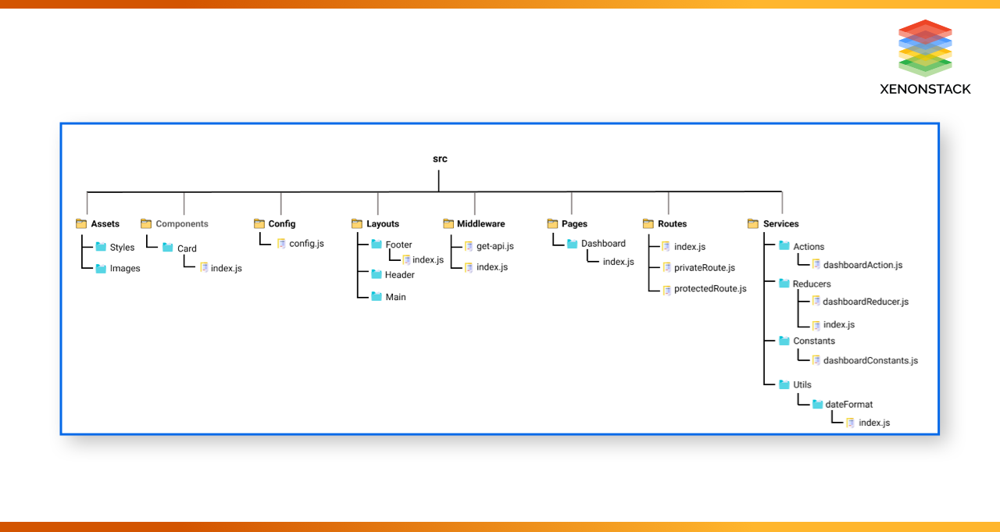

# D.A.N.T.E.
 
Ce projet a été créé avec [Create React App](https://github.com/facebook/create-react-app).

---
## Scripts disponibles

Dans le dossier du projet, vous pouvez lancer :

### `npm start`

Démarre l'APP en mode DEV.\
Ouvrez [http://localhost:3000](http://localhost:3000) pour y accéder dans votre navigateur.

La page se met à jour quand vous effectuez des changements dans le code.\

### `npm test`

Lance le mode Test (watch).\
Lire à ce propos --> [running tests](https://facebook.github.io/create-react-app/docs/running-tests).

### `npm run build`

Construit l'APP pour la PROD dans le dossier `build`.\
L'APP est compilée (en bundle) et optimisé.
Le build est minifié et l'APP est prête à être déployée.

Lire à ce propos --> [deployment](https://facebook.github.io/create-react-app/docs/deployment).

### `npm run eject`

**Note: this is a one-way operation. Once you `eject`, you can't go back!**

If you aren't satisfied with the build tool and configuration choices, you can `eject` at any time. This command will remove the single build dependency from your project.

Instead, it will copy all the configuration files and the transitive dependencies (webpack, Babel, ESLint, etc) right into your project so you have full control over them. All of the commands except `eject` will still work, but they will point to the copied scripts so you can tweak them. At this point you're on your own.

You don't have to ever use `eject`. The curated feature set is suitable for small and middle deployments, and you shouldn't feel obligated to use this feature. However we understand that this tool wouldn't be useful if you couldn't customize it when you are ready for it.

---
## Structure

### Assets
Contient toutes les ressources graphiques et visuelles (images, styles, fonts, etc...).

### Components
Contient tous les composants React de l'application.

### Config
Contient le fichier de configuration embarquant les variables d'environnement utilisées pour mettre en place des configurations multi-environnement dans l'application.

### Datas
Contient tous les fichiers de données (json, ndjson, csv, etc...) utilisés localement par l'application.

### Layouts
Contient tous les layouts de l'IHM.

### Middleware
Contient les éléments customisés générant des effets de bord dans l'application. (REDUX)

### Pages
Contient les routes et les sous-dossiers de chaque page de l'application. Chaque page a son 'State' et est utilisée pour appeler une opération 'async'.

### Routes
Contient toutes les routes de l'application.

### Services
Contient les éléments propres à REDUX.

### Utils
Contient certaines fonctions isolées car répétitives dans le projet.
